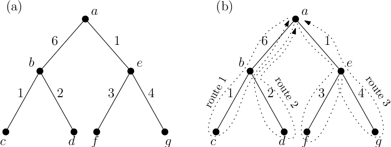

## Applying design patterns to Data Structures
Knowing patterns is a useful skill when it comes to software engineering. Design patterns are studied because they come from the trial-and-error of common issues that we encounter in programming. We most likely use some design patterns without even knowing. An easy example is the ArrayList data structure found in Java.

When we first learn Java, we are taught that arrays are static and hold a fixed number of values that need to be specified at allocation. We later realize that this is an inconvenience because there are many situations where an array should ideally be resizable. When we start a problem and decide to use an array, how do we know how big the array is supposed to be?

  

This leads to the ArrayList data structure, which is a special class that inherits the List interface. In a way, this is an example of the decorator design pattern. The ArrayList is still an array, but now we can use additional methods such as get(), remove(), indexOf(), and so on, without worrying about the size of the array. This specialized class is one of many data structures we commonly use. Another example is the PriorityQueue, which is a general solution when we need to use the first-in, first-out (FIFO) behavior of the Queue interface, but we also want this queue to have a comparator to somehow prioritize the elements we store.

## Applying design patterns to Algorithms

  

Algorithms are another fundamental of programming. A common algorithm used in problem-solving is a depth-first search. In this graph traversal method, we start at a root node and explore an arbitrary adjacent node as far as possible before backtracking. For instance, if we were trying to find a specific number in a binary tree, we would start at the root and decide if it is the number we are looking for. If not, we can arbitrarily move on to the left node, and if it is once again not the correct number, we can go left again until we reach the end. Once we reach the end, we begin backtracking and looking at the right node until an answer is found. This is the same idea as the visitor design pattern. The visitor is a behavioral design pattern that chooses which function/algorithm should be applied when visiting an object. In the case of the binary tree, if the end is reached (the next left node is null), then we invoke a backtracking method to move to the previous node and begin searching. In other words, the depth-first search algorithm used is an application of the visitor design pattern.

So why do we distinguish design patterns, data structures, and algorithms as the fundamentals of programming? If design patterns are typical solutions to commonly occurring problems in software design, then data structures and algorithms are solutions designed to solve the smaller problems of software design. Although design patterns can be used to describe data structures and algorithms, the same cannot be said the other way around. The depth-first search algorithm cannot be called a design pattern, but its principle comes from a design pattern. However, it can be difficult to draw lines between these three fundamentals. In the end, it might be better to connect these ideas when thinking of a solution for both large and small problems in software design.

