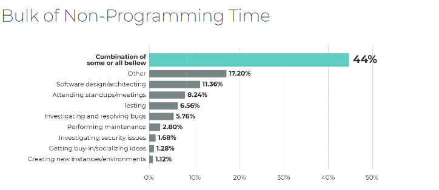

Looking back on this semester, I have learned many things about software engineering. According to [this](https://www.activestate.com/wp-content/uploads/2019/05/ActiveState-Developer-Survey-2019-Open-Source-Runtime-Pains.pdf) report by ActiveState, about 61 percent of software engineers spend less than 4 hours a day programming. When not programming, 44 percent of their time is spent on other activities such as software design, attending meetings, testing, etc. Although I dedicated a fair amount of time to coding this semester, I learned other important skills such as open-source software development and agile project management.

  

## The non-programming skills I learned
Open-source software development is source code that is publicly available for other developers to use, modify, and share. This semester, my group created a useful web application for university students to find clubs based on their interests. We created this using popular open-source software such as React and Meteor. We also had a template from our professor, which greatly sped up the development process. Although there was thorough documentation about these tools, I had my fair share of struggling with open-source software. I remember one instance when I was researching and modifying libraries to convert CSV files into JSON format for a couple of days. These libraries weren’t exactly right for my problem, and I resorted to hardcoding. In the end, looking through all those forums and learning more about new libraries was a good learning experience for my future in programming.

Another part of software development is project management. For the web application mentioned earlier, we used issue-driven project management. In the beginning, our group created milestones with several “issues” that we wanted to finish by a certain time. We began with core features such as creating collections for our data and mockups of our webpages. As we progressed through our project, our group held weekly meetings to discuss new and useful features such as adding search functionality and webpage testing. Although I have not worked on many group projects with software development, I was able to work well in a group and produce a successful web application.

## What's next?
As I continue to prepare myself to become a software engineer, I realized that a lot can be learning through projects. With the experience I gained so far, I feel more confident about exploring new frameworks and open-source software to fit my needs. I have also learned how important it is to test programs and create documentation if I plan to release projects for others to use. I look forward to new projects and problems to solve through software development.

