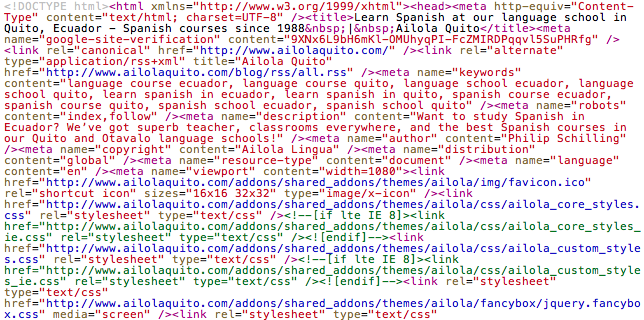

## The importance of coding standards
Coding standards are important for any project because it allows programmers to write consistent and readable code. It is an easy way to increase work efficiency and fix errors quickly. There is a reason why the term “spaghetti code” exists. It’s because code can be written without format. Similar to how we have specific margins and line spacing for writing essays, code should have formatting so that it is easier to read. The indentations and line hierarchy we use for coding have a purpose that helps both the reader and programmer.

  

## Into the unknown
My first experience with HTML/CSS was a nightmare. I had to develop the user interfaces for a website and I had never learned the front-end languages used. There were deadlines and I had to make the web pages look perfect. I remember spending hours using padding to place elements in the exact positions from the mock-up designs. At the time, I didn’t know this was a bad practice since I didn’t fully understand padding. The website was tested on both iPad and desktop, and as you can guess, the website was a mess on the iPad.

After searching for solutions, I came across the documentation for the Angular framework. I knew our project was using Angular, but I didn’t know what a framework was and what it was used for. I realized that a framework was going to be my answer. After learning some of Angular’s features, I found out how to make tables and place elements properly. It was also convenient for me to learn features since Angular is well-documented with examples that showed what the HTML/CSS would like on a sample webpage.

## A modern framework
In the past week, I have worked with Semantic UI to create web pages and learn about its features. This framework is amazingly convenient for developing web pages with a variety of easy element customization. In retrospect, Angular was good for mobile and website development using MVC, but I prefer the convenience of writing little CSS. Semantic has an elegant design and the documentation is very user-friendly, making it easy to learn.

My favorite feature of Semantic UI is that I can use adjectives for classes. In raw HTML/CSS, I would have to make a standard element and then style several properties in the stylesheet. With Semantic UI, I can make the class be “ui big button” and a big button would appear. I could use other adjectives for centering, coloring, and other properties without writing CSS. The menu bar class is another feature that is also easy to use. In general, Semantic UI cuts down on some of the extra coding that raw HTML/CSS requires. The modern designs and practical features make Semantic UI a great framework.
