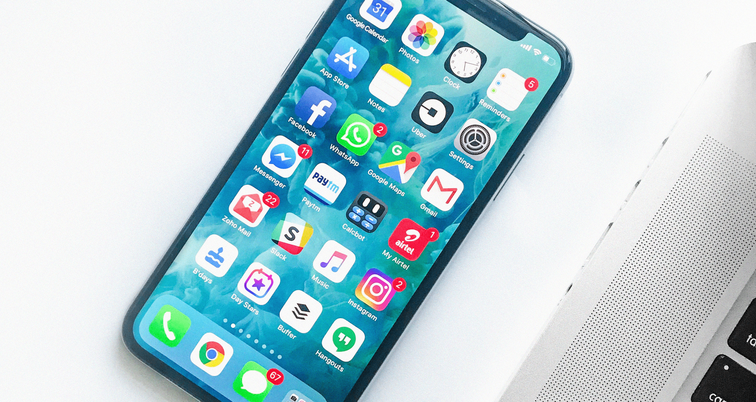
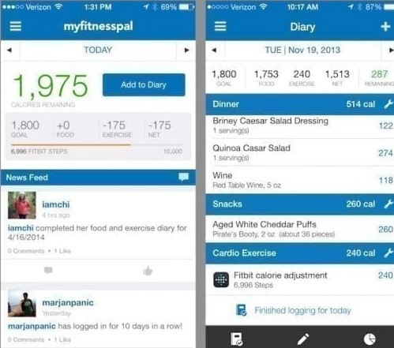

  

As an aspiring software engineer, I’m really interested in web and mobile app development. Mobile devices, such as phones and tablets, have become our handiest tool. Whether we need to find driving directions, use a calculator, plan events, etc., there is an app we can use! I’d like to learn the skills to create new apps that will be useful for the future. This involves skills such as UI/UX designs, handling data, and more.

One app that I really like is MyFitnessPal. One of my hobbies is going to the gym and the app is almsot an essential tool. It features a daily log where you can input the foods and portions you eat and track each macronutrient such as protein, carbs, etc. Inside the app, you can put goals, such as weight loss/gain, and find out the right amount of calories and macronutrients to eat. I like how easy it is to use and how much information you can get from simply logging in what you eat.

  

I’d like to be a software engineer in this type of field. Apps that can make daily processes faster and more convenient will be a large part of the future in tech. I’ve had experience with building a private web application for employees to use through an ASP (application service provider). I hope to have more experiences in developing applications that can improve the quality of life in the future. 

