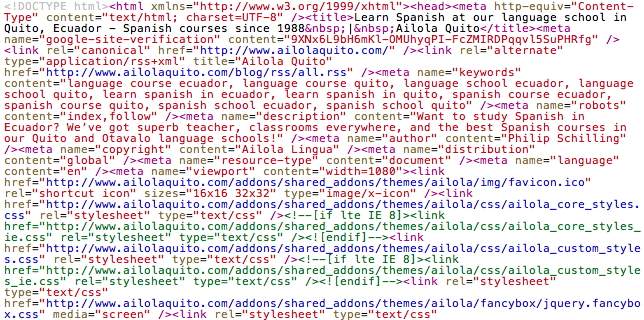

## The importance of coding standards
Coding standards are important for any project because it allows programmers to write consistent and readable code. It is an easy way to increase work efficiency and fix errors quickly. There is a reason why the term “spaghetti code” exists. It’s because code can be written without format. Similar to how we have specific margins and line spacing for writing essays, code should have formatting so that it is easier to read. The indentations and line hierarchy we use for coding have a purpose that helps both the reader and programmer.

  

I remember an instance where I was working on a web application and I could not get a webpage to load properly. The main issue was that there was an error with a header and image that would make the webpage appear blank. It took me three hours to fix this error, even though I knew which part of the code I should look at. However, the issue was not easy to exactly find because of my non-existent coding standards. The indentations and 
 tags were not aligned, making the issue more tedious. In retrospect, the error could have been solved in an hour or less.

When working professionally with other programmers, coding standards become extremely important. It is important that someone can look at a part of the code and pick it up so that progress can be made. If it takes an unreasonable amount of time to understand what’s going on then it makes project work difficult. Working in a team can be a challenge in itself; there’s no need to make work harder.

## My experience with ESLint
After using ESLint with IntelliJ for a week, I have come to appreciate some of the benefits of coding standards. It can identify redundant lines and sometimes automatically fix syntax errors. At first, I thought it was time-consuming to set up because the configurations must always be made when opening a new project. However, I find that the green check on my code is easy since I’m already familiar with most of the syntax practices. Some of the ESLint corrections with whitespace can be somewhat troublesome, but for the most part, I think it is overall beneficial.

