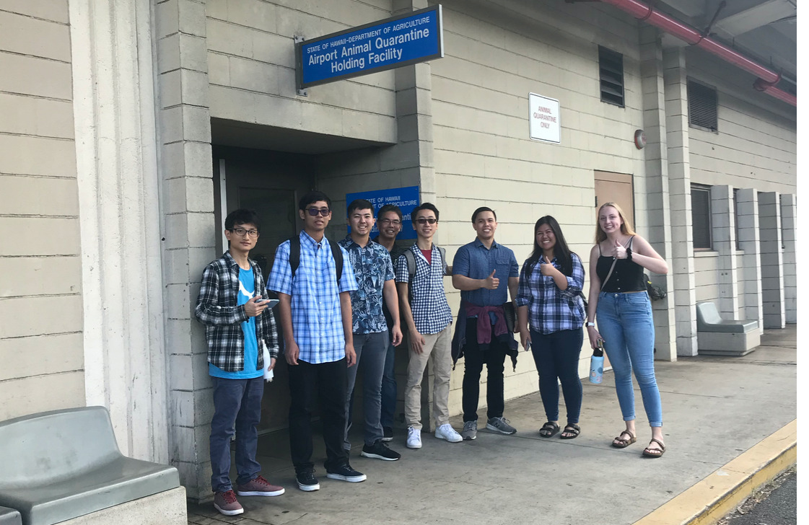

  

For my junior project, I was given the opportunity to work with DataHouse through the Community Innovation Mentorship Program. The project was to deliver a digitized solution to the Animal Quarantine facility at the Honolulu Airport. Our team, under the mentorship from DataHouse, worked closely with the Hawaii Department of Agriculture to create a smart check-in system using a kiosk and a web application for both employees and pet owners. 

The web application had a process for pet owners to check in using an iPad kiosk. From there, the pet owner would be placed in a queue and their queue number and status would appear on a large display screen. Once the status indicates completion, the pet owner would go to the front desk for more information. I worked on the front-end development of this web application to manage the JavaScript APIs and model the interface with a UI/UX designer.

This experience allowed me to learn front-end development from scratch and the different processes that go into web development. Additionally, I learned professional social skills because our group had meetings DataHouse and the Department of Agriculture on a weekly basis for updates and drafts of the application. By the end of the project, it felt great that I could say "I created my first website!"

A video of the final solution can be found below:

  <iframe width="560" height="315" src="https://www.youtube.com/embed/c3d31JSaX8o" frameborder="0" allow="accelerometer; autoplay; encrypted-media; gyroscope; picture-in-picture" allowfullscreen></iframe>

