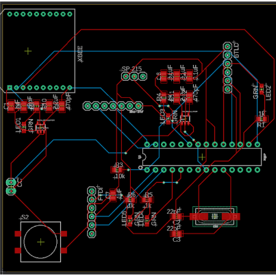

  

In Spring 2019, I was a member of Team Shokugeki at the Smart Campus Energy Lab (SCEL). Our goal is to increase the use of renewable energy through technology. Many of the members are electrical or computer engineers that work in teams. There are several ongoing projects with SCEL such as collecting weather data and weather forecasting using cheap and self-sustainable parts.

I worked on building the PCB board for a weather box. The PCB board was a custom-designed electrical circuit board that powered all sensors using a rechargeable battery. The weather box would be placed at spots on the UH Manoa campus and collect weather data such as temperature, humidity, etc. Since the weather box was powered by a rechargeable battery, the device itself was self-sustaining and would send the data back to SCEL servers for analyzing.
I also used C++ to run executables such that the weather box would send all weather data at regular minute intervals all day. 

  

Throughout this project, I learned how software and hardware were tied together in a product. The process of making a PCB was an interesting skill to learn because architecture is an important part of designing a custom board. Additionally, it was fun to see the different products and applications that can be made using an Arduino/PCB as a base.

