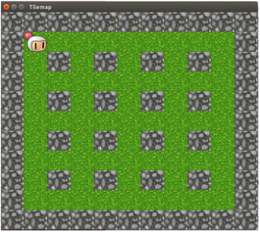

  

My friend and I created a clone of the classic game Bomberman. The clone was made for EE205: Object-Oriented Programming as a final project. The game was made using C++ on a linux system.

Our final project was to use all the techniques we learned in C++ and use the SFML library. I had to implement functions to detect and prevent character collisions, assign sprites to objects, and generate tilemaps for the base of the game. The game was a big project to take on since the real Bomberman had powerups and more graphics, but our group managed to make most of the game.

Since this project was done through the rise of Covid-19, our group had to communicate through Discord and GitHub. I learned how to make use of online resources to familiarize myself with a new C++ library. It was a great learning experience of distance working.

