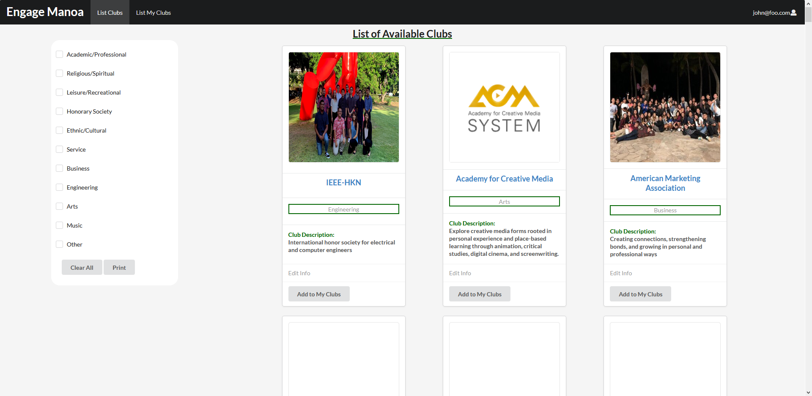

  

For ICS314, our group created a web application for students to find clubs based on their interests. It features a list of all the officially registered clubs at UH Manoa found [here](http://www.manoa.hawaii.edu/studentlife/studentorg/rio.php). Each club has a card that displays the name, category, and a short description of the club. If the club has an official website, clicking on the club name will redirect you to their official website to learn more about the club and its activities. Additionally, the club president or admin email is listed in case you would like to email him/her for more information. 

The web application was made using Semantic React and Meteor. Our GitHub repository with the source code can be found [here](https://github.com/engage-manoa/engage-manoa). It was created using issue-driven project management using milestones. Our development history can be found on our [project webpage](https://engage-manoa.github.io/), which also contains instructions for downloading and running the application locally. 

In its current state, the web application is a little empty because it is meant to be driven by users. Ideally, the club presidents would create accounts on this website and put more information and images on their club card. The most important goal for our group was to make a web application with great functionality that any student could use. Throughout the life cycle of this project, I learned how to work in a group and incrementally improve the web application. Weekly meetings in our group allowed us to know what progress we made and the issues we encountered at each improvement. Overall, it was a positive experience in developing software as a small group.
